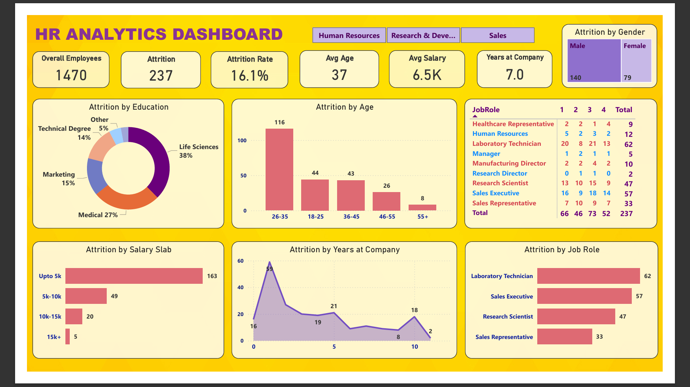

# HR-Attrition-Analysis
This Power Bi dashboard analyzes employee attrition trends in a company based on age, salary, department, gender, job role, years of service and job satisfaction.
The Goal is to identify key factors influencing employee turnover and provide data-driven insights for HR decision-making.

---

## Key Insights 

- Sales has the highest attrition, while R&D has a lower rate.

- Low salaries (upto 5k) see the most attrition.

- Most employess leave within the first two years. 

- Mid-career employees (26-35 years) have the highest turnover.

- Lab technicians and Sales Executives experience the most attrition.

---

## Data Cleaning and Preparation

The dataset was cleaned and prepared using the following steps :

- Removed duplicates to ensure accuracy

- Handled null values by appropriate imputation or removal

- Standardized categorical values for consistency

- Ensured data integrity for meaningful Analysis

---

## Dashboard Features

- Interactive visualizations to explore attrition trends

- Filters for deeper insights ( e.g., by department, gender, salary, age) 

- Dynamic KPIs to track attrition rates across various dimensions

---

## Screenshots

### HR Dashboard Overview

### Attrition by Department

---

## Tools Used

- Power BI - Data cleaning, visualization and dashboard creation

- CSV file - Data source used for Analysis

---

## Connect with Me

**[Linkedin](https://www.linkedin.com/in/akanksha-ghadage?lipi=urn%3Ali%3Apage%3Ad_flagship3_profile_view_base_contact_details%3BdlFNzzQrTAiOhMUx8JAUmA%3D%3D)**    &emsp; &emsp; &emsp; &emsp; &emsp; &emsp; &emsp; &emsp; &emsp;  **[GitHub](https://github.com/akanksha-ghadage)**

